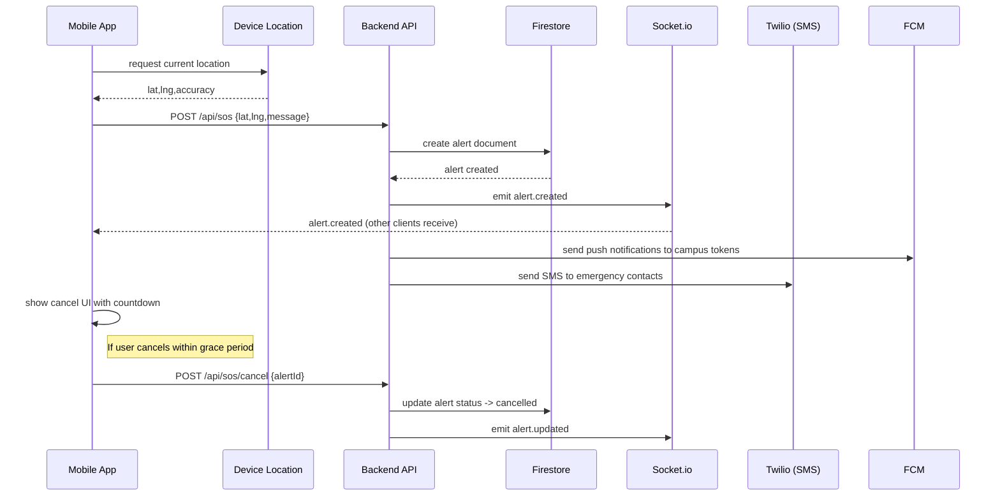

# UI Wireframes & Flows

This document contains quick wireframes and flow diagrams for the mobile app and admin dashboard. Use these as a starting point for UI design or handoff.

## Mobile — Main screens
1. Home (big SOS button)
   - Large circular red button centered
   - Small "Send SOS" label, subtitle: "Sends location + notifies contacts"
   - Top-right: Profile/settings icon
   - Bottom: "Campus Alerts" feed preview (recent alerts)
2. SOS Confirmation (after tap)
   - Toast modal: "Sending..." with spinner
   - Short cancel banner at top with countdown (e.g., 30s) and "Cancel" button
3. Alert Sent / Active
   - Shows map with your pinned location and alert status
   - Buttons: "I'm safe" (send follow up), "Share" (copy link)
4. Alerts feed
   - Map + list of active/acknowledged alerts
   - Filter: active/all/my alerts

## Admin Dashboard (web)
- Left nav: Alerts, Map, Users, Contacts, Settings
- Alerts table: id, user, time, status, actions (acknowledge, assign)
- Map: clustered alerts, click to open alert detail, acknowledge
- Alert detail: timeline of events, responder notes, mark resolved

## Flow: One-tap SOS (Mermaid sequence)

## Low-fidelity mock (ASCII)
Home screen:
+------------------------------------+
| Profile |           Campus SOS     |
|------------------------------------|
|                                    |
|         [ BIG RED SOS BUTTON ]     |
|                                    |
|      "Press once to send help"     |
|------------------------------------|
| Recent alerts:                      |
| - 10m ago: Student reported a fall |
| - 30m ago: Suspicious activity     |
+------------------------------------+

## Accessibility notes
- Large, high-contrast SOS button with at least 44px touch target.
- Voice activation: support OS-level voice commands and assistive tech.
- Haptic feedback when SOS is sent.
- Localized strings and configurable notification preferences.